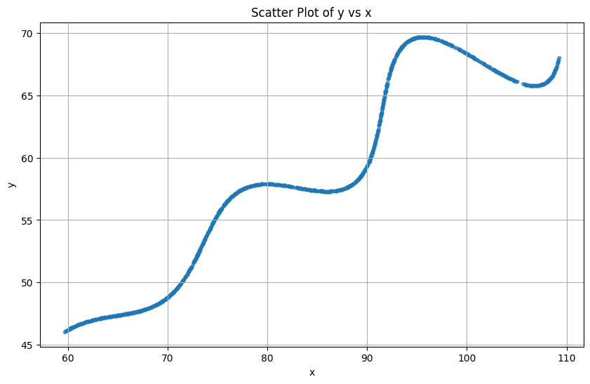
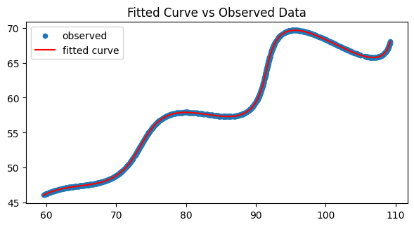
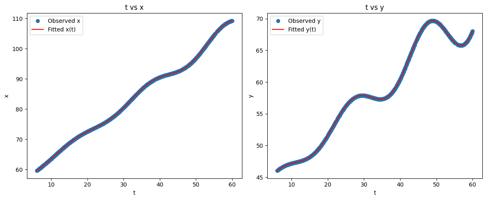

# FLAM Research Submission

## Finding the optimal parameter values for the parametric equations

This repository contains code to fit the parametric equations to observed data points using an alternating optimization approach. The goal is to estimate the parameters \((\theta\_{deg}, M, X)\) and the corresponding \(t\) values that minimize the least squares error between the observed and modeled points.

## Solution

$$x = (t \cdot \cos(30) - e^{0.03|t|} \cdot \sin(0.3t)\sin(30)+55)$$

$$y = (42 +  t * \sin(30) + e^{0.03|t|} \cdot \sin(0.3t)\cos(30))$$

## Alternating Optimization Approach

For finding the optimal parameters, we use an alternating optimization approach. Alternating optimization (Block Coordinate Descent) is used in signal and image processing works, where we iteratively optimize one set of variables while keeping the others fixed.

Steps:

- Parameter Initialization: Start with initial guesses for the parameters $(\theta, M, X)$.
- Fix one, optimise the others.
- Fix another, optimise the rest. Continue this process iteratively.

Repeat until convergence criteria are met (e.g., change in objective function below a threshold or maximum iterations reached).

## x and y Parametric Equations

$$x = (t \cdot \cos(\theta) - e^{M|t|} \cdot \sin(0.3t)\sin(\theta)+X)$$

$$y = (42 +  t * \sin(\theta) + e^{M|t|} \cdot \sin(0.3t)\cos(\theta))$$

Where: $\theta, M, X$ are unknowns to be estimated.

Ranges of unknowns:

- $0 \degree < \theta < 50\degree$
- $-0.05 < M < 0.05$
- $0 < X < 100$

Range of t : $$0 < t < 60$$

## Code Implementation

### Data Visualization

The _xy_data.csv_ file is visualized using pandas and matplotlib libraries to understand the distribution of observed points. There are 1500 datapoints in total within the range $60 < x <110$ and $46 < y < 70$, making visualization of all the points difficult at once.

Hence, a scatter plot with alpha blending $(\alpha = 0.5)$ and a small pointer size $(s = 10)$ is used to visualize the data points.

#### Main Data Scatter Plot



Figure: Scatter plot of the dataset (alpha=0.5, point size=10) showing the distribution of the 1500 observed points.

Inference from the plot: As the equation suggests, the data points seems to follow a sinusoidal pattern with an increasing amplitude as x increases.

### Mathematical Formulation

Functions for the parametric equations and residuals are defined using numpy and scipy.

#### Parametric Equation

```python
def model(t, theta_deg, M, X):
    theta = np.deg2rad(theta_deg)
    x = t * np.cos(theta) - np.exp(M * np.abs(t)) * np.sin(0.3*t) * np.sin(theta) + X
    y = 42 + t * np.sin(theta) + np.exp(M * np.abs(t)) * np.sin(0.3*t) * np.cos(theta)
    return x, y
```

#### Residual Function

Calculates the least square residuals between the observed and modeled points.

```python
def residuals(p, t_vec, x_obs, y_obs):
    theta_deg, M, X = p
    x_model, y_model = model(t_vec, theta_deg, M, X)
    return np.r_[x_model - x_obs, y_model - y_obs]
```

#### Finding optimal t values for given parameters

The function uses scalar minimization to find the best t value for each observed point given the current parameters.

```python
def find_best_t(xk, yk, theta_deg, M, X, t_bounds = (6.0, 60.0)):
    def sq_dist(t):
        xm, ym = model(t, theta_deg, M, X)
        return (xm - xk)**2 + (ym - yk)**2
    res = minimize_scalar(sq_dist, bounds=t_bounds, method='bounded', options={'xatol':1e-3})
    return res.x
```

#### Optimization Function

The main optimization function that alternates between optimizing parameters and t values until convergence. For initial t, it uses chord lengths to space the t values reasonably.

Followed by running the optimization loop, updating parameters and t values iteratively.

```python

def alternating_fit(x_obs, y_obs,
                    init_theta=10.0, init_M=0.0, init_X=10.0,
                    max_iters=1000, tol=1e-6):
    N = len(x_obs)
    # init params
    p = np.array([init_theta, init_M, init_X], dtype=float)

    pts = np.column_stack([x_obs, y_obs])
    '''
    Chord Lengths are used to initialize t values,
    cause they are a reasonable initial estimate for a starting point
    '''
    dists = np.sqrt(((pts[1:] - pts[:-1])**2).sum(axis=1)) # Chord Lengths
    cum = np.concatenate([[0.0], np.cumsum(dists)]) # Cumulative chord lengths of all points

    # If there's no distance, just space t evenly
    if cum[-1] <= 0:
        t = np.linspace(6.0, 60.0, N)
    else:
        t = 6.0 + (60.0-6.0) * (cum / cum[-1])
    last_obj = np.inf

    # Optimization loop
    for it in range(max_iters):
        # projecting every point to update t_i
        t_new = np.empty_like(t)
        for k, (xk, yk) in enumerate(zip(x_obs, y_obs)): # for each data point, find best t
            t_new[k] = find_best_t(xk, yk, *p, t_bounds=(6.0,60.0))
        #fit params between the bounds provided
        lower = [0.0, -0.05, 0.0]
        upper = [50.0, 0.05, 100.0]

        # calculating the least squares fit
        res = least_squares(residuals, p, bounds=(lower, upper),
                            args=(t_new, x_obs, y_obs), xtol=1e-8, ftol=1e-8)
        p = res.x # update params
        # check objective
        obj_val = 0.5 * np.sum(res.fun**2) # update objective value

        # If converged (based on tolerance), stop iterations
        if abs(last_obj - obj_val) < tol:
            t = t_new
            break
        last_obj = obj_val
        t = t_new

    # Return final parameters, t values, and objective value
    return p, t, obj_val
```

### Comparison Plot between Observed and Fitted Data





## Author

- Saksham Kumar [GitHub](https://github.com/Polymath-Saksh) [LinkedIn](https://www.linkedin.com/in/sakshamkr1/)
